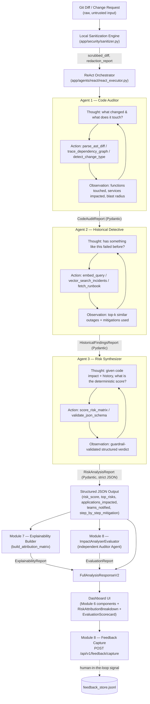
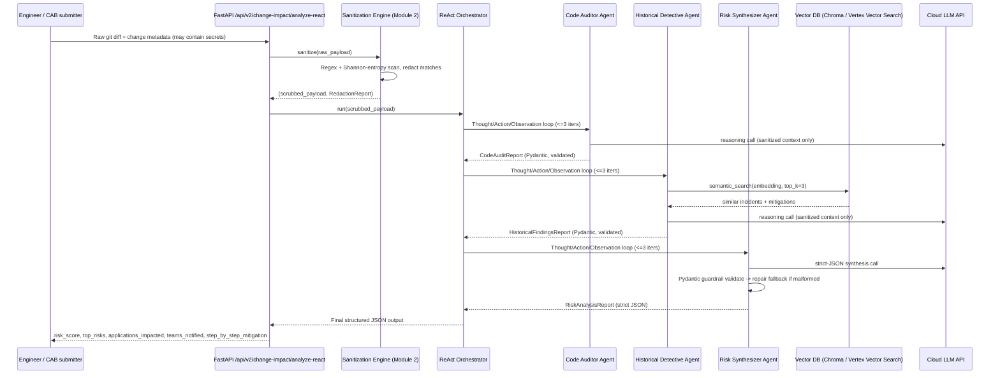
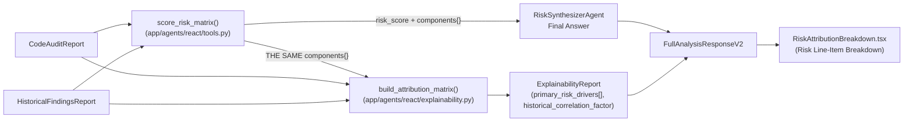
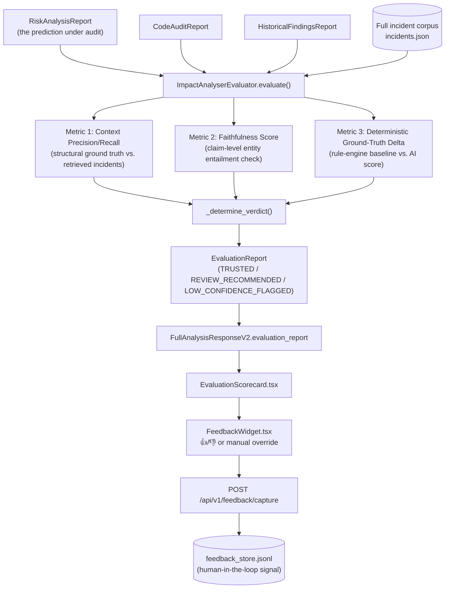

# AI Change Impact Analyzer — Production Architecture Blueprint
### ReAct Multi-Agent Edition (v2)

> Audience: Engineering reviewers / hackathon judges at a major bank.
> Scope: This document is the architectural companion to the `react/` agent
> package, the `security/sanitizer.py` privacy engine, the `rag/vertex_embeddings.py`
> + `rag/vector_search.py` retrieval layer, and the `agents/schemas.py` guardrails
> shipped in this repository. It extends (does not replace) the existing 7-agent
> mock pipeline documented in `README.md` — the new v2 surface is exposed at
> `POST /api/v2/change-impact/analyze-react` and is designed to be the
> "bank-grade" hardening pass on top of the hackathon MVP.

---

## MODULE 1 — Agentic System Architecture & Data Flow

### 1.1 Why ReAct (Reason + Act), not a static pipeline

The original 7-agent pipeline (`app/pipeline.py`) is a **fixed DAG**: every
request walks the same 7 stages regardless of whether a stage's output was
useful. That is fine for a demo, but it does not scale to real bank change
requests where:

- A one-line config diff needs almost no dependency tracing, but a
  cross-service schema migration needs multiple rounds of dependency lookups.
- The "right" historical incidents to retrieve are not known until the code
  auditor has actually identified *which* components changed.
- Agents must be able to say "I don't have enough evidence yet, let me look
  again" — a capability a static pipeline does not have.

The ReAct pattern (Yao et al., 2022) solves this by giving each agent an
explicit `Thought → Action → Observation` loop: the agent reasons about what
it knows, chooses a tool to call, observes the tool's output, and repeats
until it has enough evidence to produce a final structured answer — or until
a hard iteration cap is hit (see Module 5).

### 1.2 The 3-Agent Pipeline



| # | Agent | Responsibility | Tools it can call (Actions) | Data source |
|---|-------|-----------------|------------------------------|--------------|
| 1 | **Code Auditor Agent** | Parses the (sanitized) git diff, walks the AST to find touched symbols, resolves the CMDB dependency graph to compute blast radius | `parse_ast_diff`, `trace_dependency_graph`, `detect_change_type` | `ai-service/data/cmdb.json`, `ai-service/data/source_registry.json`, the diff itself |
| 2 | **Historical Detective Agent** | Autonomously queries a vector DB of past incidents/runbooks using embeddings derived from Agent 1's findings; ranks similarity, extracts mitigations that worked | `embed_query`, `vector_search_incidents`, `fetch_runbook` | Vector index over `ai-service/data/incidents.json` + `ai-service/data/runbooks/*.md` |
| 3 | **Risk Synthesizer Agent** | Combines the code-impact report and historical-findings report into a deterministic, bounded risk score and a strict JSON verdict; runs the guardrail validator and triggers the fallback repair path on malformed output | `score_risk_matrix`, `validate_json_schema` | Outputs of Agent 1 + Agent 2 only (no new I/O — keeps this agent deterministic and auditable) |

All three agents subclass `ReactAgent` (`app/agents/react/base_react_agent.py`),
which implements the generic ReAct loop, tool dispatch, transcript logging,
and the `max_iterations` guardrail. Concrete agents only declare their tool
set and their Pydantic output contract.

### 1.3 End-to-End Data Flow



**Key invariant:** the raw, unsanitized diff **never** leaves the local
process boundary. Only the output of `app/security/sanitizer.py` is placed
into any prompt sent to a cloud LLM or embedding API. This is enforced
structurally — `ReactAgent._call_llm()` only accepts a `SanitizedContext`
typed object, not a raw string, so an engineer cannot accidentally wire a raw
diff into a cloud call without a type error.

---

## MODULE 5 — Scalability & Enterprise Edge-Case Analysis

### 5.1 Token context window limits on massive legacy repositories

A bank's monorepo can be tens of millions of lines. Sending "the diff" is
easy; sending "the diff plus enough surrounding context to understand it" is
not, once a change touches a file with a 40-year-old COBOL-to-Java bridge
layer. We mitigate this on four levels:

1. **AST-level slicing, not file-level slicing.** `parse_ast_diff` (Module 1,
   Code Auditor) never sends whole files to the LLM. It parses only the
   changed functions/classes plus their direct call-graph neighbors (one hop)
   using `ast` (Python) / a language-appropriate parser, so the payload is
   O(changed symbols) rather than O(repository size).
2. **Hierarchical map-reduce summarization for large diffs.** If a diff
   still exceeds the configured token budget
   (`MAX_AUDITOR_CONTEXT_TOKENS`, default 6,000 tokens), `CodeAuditorAgent`
   chunks the diff by file, summarizes each chunk independently (map step),
   then asks the LLM to synthesize the per-file summaries into one
   blast-radius assessment (reduce step). This bounds cost/latency linearly
   in diff size while keeping every chunk under the model's context window.
3. **Dependency graph over raw code for "reach".** Instead of asking the LLM
   to infer which of 500 downstream microservices are affected by reading
   code, we precompute that deterministically from `cmdb.json` via graph
   traversal (`trace_dependency_graph`, BFS bounded to depth 5). The LLM is
   only asked to *reason about* a graph that is already small and structured
   — not to *discover* the graph from unbounded source text.
4. **Retrieval instead of stuffing for history.** The Historical Detective
   never pastes incident logs into the prompt wholesale; it retrieves only
   the top-3 semantically relevant incidents (Module 3) and their mitigation
   text, which is a bounded, small payload regardless of how many thousands
   of historical incidents exist in the vector index.

```python
def enforce_token_budget(text: str, max_tokens: int, encoding_name: str = "cl100k_base") -> str:
    """Truncate/chunk text defensively so it never exceeds the model context window."""
    import tiktoken
    encoding = tiktoken.get_encoding(encoding_name)
    tokens = encoding.encode(text)
    if len(tokens) <= max_tokens:
        return text
    return encoding.decode(tokens[:max_tokens]) + "\n\n[TRUNCATED: exceeded token budget, see chunked map-reduce summary instead]"
```

### 5.2 Execution caps to prevent expensive agent loop deadlocks

Every `ReactAgent` loop is bounded by a hard `MAX_ITERATIONS = 3` constant
(`app/agents/react/base_react_agent.py`). This is not a soft suggestion in a
prompt — it is enforced in code:

```python
MAX_ITERATIONS = 3

def run(self, context: "SanitizedContext") -> "AgentResult":
    for iteration in range(1, MAX_ITERATIONS + 1):
        thought = self._reason(context, iteration)
        if thought.is_final:
            return self._finalize(thought, iteration)
        observation = self._act(thought.action, thought.action_input)
        context = context.with_observation(observation)
    return self._force_finalize_on_cap(context, reason="max_iterations_exhausted")
```

Design decisions behind this:

- **Fail closed, not open.** If iteration 3 completes without the agent
  declaring `is_final=True`, we do **not** retry indefinitely or return an
  error to the caller. We call `_force_finalize_on_cap`, which asks the LLM
  exactly once more with a `"You must answer now with your best available
  evidence"` directive and, if that also fails Pydantic validation, falls
  back to the deterministic rule-based synthesis path (Module 4). The caller
  always gets a valid, schema-conformant answer within bounded time.
- **Per-agent, not per-pipeline, caps.** Capping only the overall pipeline
  would let one runaway agent starve the other two of their share of
  latency/cost budget. Capping per-agent means the worst case for the whole
  3-agent pipeline is a known, provisionable constant: `3 agents × 3
  iterations × 1 LLM call ≈ 9 LLM calls` maximum per analysis, which is what
  gets used for capacity planning and per-tenant rate limiting.
- **Circuit breaker at the tool layer, too.** Tools like
  `vector_search_incidents` and `trace_dependency_graph` have their own
  timeouts (`httpx` timeout + `tenacity` retry with `stop_after_attempt(2)`),
  so a single slow external dependency cannot itself turn into an unbounded
  loop dressed up as "the agent is still reasoning."
- **Full transcript retained regardless of outcome.** Every
  Thought/Action/Observation is appended to `AgentTrace.react_transcript`
  (visible in the "Agent Trace" tab of the dashboard) so that even a
  cap-exhausted run is fully auditable — critical for a bank's change
  management evidence trail.

### 5.3 Additional bank-grade considerations addressed in code

- **Determinism for compliance sign-off.** The final `risk_score` is not
  purely LLM-generated; `RiskSynthesizerAgent.score_risk_matrix` computes it
  from a documented, versioned weighted formula (change type, blast radius,
  historical severity, criticality of impacted services) so that two runs
  over the same inputs produce the same score — a hard requirement for CAB
  (Change Advisory Board) audits. The LLM call augments this with narrative
  justification but cannot override the numeric score outside a bounded
  correction window (±5 points, logged when applied).
- **Idempotency & caching.** Requests are hashed on
  `(scrubbed_diff_hash, target_component, change_type)`; identical resubmits
  within a 15-minute TTL are served from a local cache to avoid redundant
  LLM spend during CAB review cycles when reviewers re-run the same request.
- **PII/secret leak is a release blocker, not a warning.** The sanitizer
  (Module 2) raises `SanitizationError` and the API returns HTTP 422 if
  redaction confidence is ambiguous for a high-entropy token near a
  connection-string-shaped context, rather than silently forwarding a
  possible credential to a cloud LLM "just in case it was a false positive."

---

## MODULE 7 — Explainable AI (XAI) & Attribution Pipeline

### 7.1 The core goal

A raw `"risk_score": 85` is not actionable — and, for a bank's Change
Advisory Board (CAB), not auditable. A developer or a CAB reviewer must be
able to answer "why 85 and not 40?" without reading agent transcripts. Module
7 forces the Risk Synthesizer's output to always be accompanied by a strict,
structured **Attribution Matrix**: a small, ranked list of the concrete
signals that produced the score, each carrying an explicit percentage weight.

### 7.2 Design principle: explanation cannot diverge from computation

The single biggest risk with "AI explainability" features is that the
explanation is itself a separate LLM generation that can silently disagree
with the number it claims to explain (a second hallucination surface on top
of the first). Module 7 eliminates that risk structurally: every
`RiskDriver.severity_weight` is a **direct percentage of the same
`components` dict** that `score_risk_matrix()` (Module 1/4,
`app/agents/react/tools.py`) used to compute the numeric `risk_score` in the
first place. There is no second, independent narrative — the "explanation"
literally cannot say anything the deterministic formula didn't already do.



### 7.3 JSON schema extension

`app/agents/schemas.py` gains two new strict Pydantic models, and
`FullAnalysisResponseV2` (`app/agents/react/api_models.py`) gains an
`explainability_report` field carrying them:

```python
class RiskDriver(BaseModel):
    """One line-item in the Risk Synthesizer's attribution matrix — a single,
    named reason the risk score is what it is, traceable back to a concrete
    code location or structural signal (never a vague, unfalsifiable claim)."""

    model_config = {"extra": "forbid"}

    driver_id: str
    code_snippet: str          # the exact diff line(s), or a labeled structural descriptor
    file_path: Optional[str] = None
    severity_weight: float = Field(..., ge=0.0, le=100.0)   # % contribution to risk_score
    justification_text: str
    category: str               # blast_radius | criticality | historical_precedent | change_type_baseline


class ExplainabilityReport(BaseModel):
    """Attached to every FullAnalysisResponseV2."""

    model_config = {"extra": "forbid"}

    primary_risk_drivers: List[RiskDriver] = Field(..., min_length=1, max_length=10)
    historical_correlation_factor: str
    total_attributed_weight: float = Field(..., ge=0.0, le=100.0)
    generated_at_ms: int
```

### 7.4 The attribution builder (deterministic, no LLM call)

`app/agents/react/explainability.py::build_attribution_matrix()` is invoked
by `ReactPipelineExecutor.analyze()` (`app/agents/react/react_executor.py`)
immediately after the Risk Synthesizer's Final Answer is validated:

```python
def build_attribution_matrix(
    code_audit: CodeAuditReport,
    historical: HistoricalFindingsReport,
    sanitized_diff_text: Optional[str],
    risk_score: int,
    score_components: Dict[str, int],
) -> ExplainabilityReport:
    total = max(sum(score_components.values()), 1)
    drivers: List[RiskDriver] = []

    # Group 1 — blast radius: weight distributed across touched symbols,
    # with the ACTUAL diff line extracted per symbol via _extract_snippet_for_symbol()
    blast_weight_pct = round((score_components.get("blast_radius_component", 0) / total) * 100, 2)
    # ... one RiskDriver per touched symbol, code_snippet = real diff line ...

    # Group 2 — criticality: one RiskDriver per critical/high impacted service
    # Group 3 — change-type baseline: one RiskDriver citing the versioned formula
    # Group 4 — historical precedent: one RiskDriver citing the top similar_outage,
    #           and historical_correlation_factor is built from that same record

    return ExplainabilityReport(
        primary_risk_drivers=drivers[:10],
        historical_correlation_factor=historical_correlation_factor,
        total_attributed_weight=round(sum(d.severity_weight for d in drivers), 2),
        generated_at_ms=int(time.time() * 1000),
    )
```

Full implementation: `ai-service/app/agents/react/explainability.py`.
Unit tests: `ai-service/tests/test_explainability.py` (verifies weights sum
to ~100%, every driver has a non-empty justification, snippets are only ever
extracted from real diff text — never fabricated — and the historical
correlation factor explicitly says "none found" when there is no precedent).

### 7.5 UI blueprint: `RiskAttributionBreakdown`

`frontend/src/components/dashboard/RiskAttributionBreakdown.tsx` renders the
report as a ranked "Risk Line-Item Breakdown": each driver is a row with a
category badge, a percentage-weighted bar, the code snippet rendered in a
red-bordered `<pre><code>` block (or an italicized structural placeholder
when no line-level diff was supplied), and a hoverable tooltip surfacing the
full `justification_text`. `services/dashboardAdapters.ts::riskAttributionFromV2`
maps the wire shape into the component's presentation-only prop shape so the
component itself never needs to know about `FullAnalysisResponseV2`.

---

## MODULE 8 — Automated Evaluation Metric & Ground-Truth Scoring Pipeline

### 8.1 The core goal

Module 7 explains a prediction. Module 8 asks a harder question: **should
anyone trust it at all?** `ImpactAnalyserEvaluator`
(`ai-service/app/evaluation/evaluator.py`) is a fully independent "Auditor
Agent" that runs *after* `RiskSynthesizerAgent` has already produced its
Final Answer. It never feeds back into the prediction it grades — an
evaluator that shares its subject's blind spots provides no real signal.



### 8.2 Metric 1 — Context Precision & Recall

Ground truth for "was this historical incident actually relevant?" is
computed **structurally**, never by asking an LLM to grade its own
retrieval: an incident in the full corpus counts as relevant if it shares an
impacted service with `CodeAuditReport.impacted_applications`, or its tags
overlap the inferred change type.

```python
def evaluate_context_precision_recall(
    self, code_audit: CodeAuditReport, historical: HistoricalFindingsReport,
    all_incidents: List[Dict[str, Any]], top_k: int = 3,
) -> ContextPrecisionRecall:
    impacted = {a.service_name.lower() for a in code_audit.impacted_applications}
    impacted |= {a.service_id.lower() for a in code_audit.impacted_applications}
    change_type_tokens = set(code_audit.inferred_change_type.lower().split("_"))

    relevant_ids = [
        str(inc["id"]) for inc in all_incidents
        if (impacted & {s.lower() for s in inc.get("impactedServices", [])} | {str(inc.get("service","")).lower()})
        or (change_type_tokens & {t.lower() for t in inc.get("tags", [])})
    ]
    retrieved_ids = [o.incident_id for o in historical.similar_outages[:top_k]]
    tp = len([r for r in retrieved_ids if r in relevant_ids])

    precision = (tp / len(retrieved_ids)) if retrieved_ids else 0.0
    recall = (tp / len(relevant_ids)) if relevant_ids else 1.0   # vacuously perfect if corpus has none
    f1 = (2 * precision * recall / (precision + recall)) if (precision + recall) > 0 else 0.0
    ...
```

### 8.3 Metric 2 — Faithfulness Score (hallucination check)

Every claim in `top_risks` and `step_by_step_mitigation` is checked: if it
names a specific entity (a quoted string, or a known service/incident name),
that entity **must** appear in the retrieved evidence set
(`CodeAuditReport.impacted_applications` or
`HistoricalFindingsReport.similar_outages`). Generic, non-attributable
recommendations ("Deploy to staging first") are never penalized — there is
nothing named in them to hallucinate.

$$
\text{FaithfulnessScore} = \frac{|\{c \in \text{claims} : \text{entities}(c) \subseteq \text{EvidenceEntities} \}|}{|\text{claims}|}
$$

This is a conservative, fully local approximation of the Ragas
"Faithfulness" metric. An optional `RagasFaithfulnessStrategy` (in the same
module) can be injected to attach a supplementary LLM-as-judge
`llm_judge_score` — it is never required and never overrides the
deterministic `score`.

### 8.4 Metric 3 — Deterministic Ground-Truth Delta

An **independent** rule-engine counts DB-call-shaped and API-alteration-
shaped lines literally present in the diff (regex over `SELECT/INSERT/@Query`,
`@PostMapping/@GetMapping`, etc.) and folds those counts into the same
weighted-sum family `score_risk_matrix` uses, producing a second,
code-literal baseline score the primary agents never see as one
pre-aggregated number:

$$
\text{baseline} = \text{base}_{\text{change\_type}} + \text{blast}_{0.35} + \text{criticality} + \text{history} + \min(3 \cdot n_{\text{db}},\,20) + \min(4 \cdot n_{\text{api}},\,20)
$$

$$
\text{PercentDeviation} = \frac{|\text{risk\_score}_{AI} - \text{baseline}|}{\max(\text{baseline}, 1)} \times 100
$$

```python
def compute_ground_truth_delta(
    self, ai_risk_score: int, code_audit: CodeAuditReport,
    historical: HistoricalFindingsReport, sanitized_diff_text: Optional[str],
) -> GroundTruthDelta:
    diff_text = sanitized_diff_text or ""
    db_call_count = sum(len(p.findall(diff_text)) for p in _DB_CALL_PATTERNS)
    api_alteration_count = sum(len(p.findall(diff_text)) for p in _API_ALTERATION_PATTERNS)

    base = score_risk_matrix(code_audit=code_audit.model_dump(), historical=historical.model_dump())
    components = dict(base["components"])
    components["db_call_component"] = min(db_call_count * 3, 20)
    components["api_alteration_component"] = min(api_alteration_count * 4, 20)
    baseline_score = max(1, min(100, sum(components.values())))

    delta = abs(ai_risk_score - baseline_score)
    pct = round((delta / max(baseline_score, 1)) * 100, 2)
    return GroundTruthDelta(
        ai_predicted_score=ai_risk_score, deterministic_baseline_score=baseline_score,
        absolute_delta=delta, percentage_deviation=pct,
        high_variance_warning=pct > 20.0,   # the hard-coded 20% threshold from the spec
        baseline_components=components,
    )
```

### 8.5 Aggregate verdict

```
LOW_CONFIDENCE_FLAGGED  — faithfulness < 0.5  OR  percentage_deviation > 50%
REVIEW_RECOMMENDED      — faithfulness < 0.8  OR  high_variance_warning  OR  retrieval F1 < 0.5
TRUSTED                 — otherwise
```

`ImpactAnalyserEvaluator.evaluate()` never raises: each of the three metrics
is computed inside its own `try/except`, fail-closing to a conservative
worst-case value (e.g. `faithfulness=0.0`, `high_variance_warning=True`) on
any internal error, so a bug in the auditor can never take down the primary
`/api/v2/change-impact/analyze-react` endpoint it audits.

### 8.6 Feedback loop — `POST /api/v1/feedback/capture`

```python
class FeedbackEntry(BaseModel):
    analysis_id: str
    vote: Optional[str] = None                 # "up" | "down"
    overridden_risk_score: Optional[int] = Field(default=None, ge=1, le=100)
    comment: Optional[str] = None
    submitted_by: Optional[str] = None


@router.post("/feedback/capture", response_model=FeedbackCaptureResponse)
async def capture_feedback(entry: FeedbackEntry) -> FeedbackCaptureResponse:
    if entry.vote is not None and entry.vote not in ("up", "down"):
        raise HTTPException(422, "vote must be 'up' or 'down' if provided")
    if entry.vote is None and entry.overridden_risk_score is None:
        raise HTTPException(422, "At least one of 'vote' or 'overridden_risk_score' must be provided")
    stored = default_feedback_store.capture(entry)   # durable append-only JSONL write
    return FeedbackCaptureResponse(status="captured", feedback_id=stored.feedback_id, stored_at=stored.captured_at)
```

`FeedbackStore` (`app/evaluation/feedback_store.py`) is a thread-safe,
append-only JSONL log at `ai-service/data/feedback_store.jsonl` — zero extra
infrastructure for the hackathon/demo environment, while remaining a real,
durable, offline-minable audit trail. Production hardening note: swap the
file-backed implementation for a real table (e.g. Postgres) behind the same
`capture()`/`list_for_analysis()`/`all()` interface when moving beyond a
single-node deployment — no caller-facing code changes.

The Spring Boot backend proxies this 1:1 (`ApiProxyController.captureFeedback`
/ `getFeedbackForAnalysis`, via `AiServiceClient`), and the frontend's
`FeedbackWidget.tsx` (thumbs up/down + manual score-override slider) posts to
it through `services/api.ts::submitFeedback`.

### 8.7 Why this satisfies "prove the evaluation is done right"

- **Independent of the thing it grades.** No shared LLM call, no shared
  prompt — the evaluator's only inputs are already-validated Pydantic
  objects and the raw incident corpus.
- **Every metric has a documented, versioned formula** (see `methodology`
  fields on `ContextPrecisionRecall` / `FaithfulnessScore` and
  `baseline_formula_version` on `GroundTruthDelta`), so a model-risk reviewer
  can reproduce the exact number by hand.
- **Fail-closed, not fail-open.** Any internal evaluator error defaults to
  the most conservative possible verdict rather than silently reporting
  "TRUSTED".
- **Closes the loop with a human.** `EvaluationScorecard` (automated) and
  `FeedbackWidget` (human) are keyed by the same `analysis_id`, so automated
  and human verdicts can be joined later to detect where the automated
  evaluator itself is systematically wrong — feeding future recalibration of
  `score_risk_matrix`'s weights.
