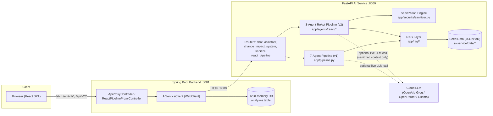
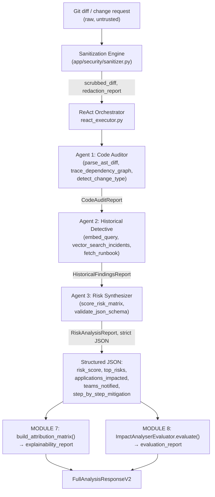

# Technical Architecture — AI Change Impact Analyzer

> Deep-dive reference for engineers. For setup instructions, see `SETUP_GUIDE.md`.
> For the bank-grade hardening design rationale (ReAct v2, sanitizer, scalability), see `ARCHITECTURE_BLUEPRINT.md`.

## Table of Contents
1. [System Overview](#1-system-overview)
2. [High-Level Architecture Diagram](#2-high-level-architecture-diagram)
3. [Module 1: Frontend](#3-module-1-frontend)
4. [Module 2: Backend](#4-module-2-backend)
5. [Module 3: AI Service](#5-module-3-ai-service)
6. [Multi-Agent Pipelines (v1 & v2)](#6-multi-agent-pipelines-v1--v2)
7. [RAG / Knowledge Retrieval Layer](#7-rag--knowledge-retrieval-layer)
8. [Security: Local Sanitization Engine](#8-security-local-sanitization-engine)
9. [Data Model & Persistence](#9-data-model--persistence)
10. [API Contract Reference](#10-api-contract-reference)
11. [Configuration & Provider Strategy](#11-configuration--provider-strategy)
12. [Containerization & Deployment](#12-containerization--deployment)
13. [Testing Strategy](#13-testing-strategy)
14. [Module 7: Explainable AI (XAI) & Attribution Pipeline](#14-module-7-explainable-ai-xai--attribution-pipeline)
15. [Module 8: Automated Evaluation & Ground-Truth Scoring](#15-module-8-automated-evaluation--ground-truth-scoring)
16. [Design Decisions & Trade-offs](#16-design-decisions--trade-offs)
17. [Known Limitations / Production Hardening Path](#17-known-limitations--production-hardening-path)

---

## 1. System Overview

The **AI Change Impact Analyzer** is a full-stack monorepo that predicts the *risk* and *blast radius* of a proposed software/infrastructure change **before** it ships — the kind of analysis a Change Advisory Board (CAB) would traditionally do manually. It is composed of three independently deployable services:

```
Frontend (React 18 + TS + Vite, :3000)
    │  HTTP (fetch)
    ▼
Backend  (Spring Boot 3.3 + Java 21, :8081)   ── persists history in H2
    │  HTTP (WebClient, reactive, non-blocking)
    ▼
AI Service (FastAPI + Python 3.11, :8000)
    │
    ▼
RAG Data Sources: cmdb.json, incidents.json, change_requests.json,
                  source_registry.json, architecture.md, runbooks/*.md
```

The backend is a thin, stateful **proxy + persistence layer**: it forwards all `/api/v1/*` business logic to the AI service and stores each analysis result in H2 so history can be browsed later. The AI service holds all of the actual intelligence — the multi-agent orchestration, retrieval, risk scoring, and (optionally) LLM calls.

---

## 2. High-Level Architecture Diagram



---

## 3. Module 1: Frontend

**Stack:** React 18, TypeScript, Vite 5, Vitest + Testing Library. No heavyweight state library or router — this is a deliberately small single-page app.

### 3.1 Structure

```
frontend/src/
├── App.tsx                     # Root component: chat + form modes, tab orchestration
├── main.tsx                    # ReactDOM entry point
├── index.css                   # Global styles / theme (light+dark)
├── components/
│   ├── ReportTabs.tsx           # Tabbed report view: Overview/Understanding/Evidence/...
│   ├── RiskGauge.tsx            # SVG risk-score gauge (low/medium/high/critical)
│   ├── SuggestionChips.tsx      # Clickable example prompts for the chat mode
│   ├── TypingIndicator.tsx      # "Agent is thinking" animation
│   └── dashboard/
│       ├── DependencyMap.tsx        # Renders impacted-service dependency graph
│       ├── IncidentMatchCard.tsx    # Renders a single similar-incident match
│       ├── RiskGaugeMetrics.tsx     # Numeric risk breakdown panel
│       ├── RiskAttributionBreakdown.tsx  # MODULE 7: Risk Line-Item Breakdown (XAI)
│       ├── EvaluationScorecard.tsx       # MODULE 8: verdict + faithfulness/precision/recall/delta gauges
│       ├── FeedbackWidget.tsx            # MODULE 8: thumbs up/down + manual score override
│       └── types.ts                 # Dashboard-specific view models
├── services/
│   ├── api.ts                   # Typed fetch wrappers for every backend/AI-service endpoint (incl. submitFeedback)
│   └── dashboardAdapters.ts     # Maps raw API responses → dashboard view models (incl. Module 7/8 adapters)
├── types/
│   ├── index.ts                 # Core domain types (ChangeImpactResponse, ChatResponse, ...)
│   └── reactAnalysis.ts         # Types for the v2 ReAct pipeline response shape
└── utils/markdown.ts            # Lightweight markdown-ish renderer + text truncation
```

### 3.2 Interaction Model

The app supports **two analysis modes**, both driven from `App.tsx`:
1. **Chat mode** — free-form natural-language input routed to `POST /api/v1/assistant/respond`, which the AI service internally classifies as either a conversational question or an implicit change-analysis request.
2. **Form mode** — a structured form (change title, type, affected services, environment, etc.) submitted to `POST /api/v1/change-impact/analyze`, returning a full structured report rendered across the `ReportTabs` component (Overview, Understanding, Evidence, Incidents, Mitigation, Agent Trace).

### 3.3 API Base URL Resolution (`services/api.ts`)

```12:16:frontend/src/services/api.ts
const API_BASE = import.meta.env.VITE_API_BASE_URL || 'http://localhost:8081'
const AI_SERVICE_URL = import.meta.env.VITE_AI_SERVICE_URL || 'http://localhost:8000'
const DIRECT_AI_MODE = import.meta.env.VITE_DIRECT_AI_MODE === 'true'
```

Every API call resolves its base URL through `getBaseUrl()`, which checks `VITE_DIRECT_AI_MODE`:
- `false` (default) → all calls go through the **Spring Boot backend** at `VITE_API_BASE_URL`, which proxies to the AI service and persists history.
- `true` → the frontend talks **directly** to the AI service at `VITE_AI_SERVICE_URL`, bypassing the backend entirely (useful for isolated AI-service development/demos, but analysis history is not persisted in this mode).

### 3.4 Build & Runtime

- **Dev**: `vite --port 3000` with a dev-server proxy (`vite.config.ts`) forwarding `/api/*` → `http://backend:8081`.
- **Prod (Docker)**: multi-stage build — `npm run build` (tsc + vite build) produces static assets served by **nginx**, which also reverse-proxies `/api` to the `backend` container (see `frontend/Dockerfile`).

---

## 4. Module 2: Backend

**Stack:** Spring Boot 3.3.4, Java 21 (compiled with `java.version=17` target in `pom.xml`), Spring WebFlux `WebClient` for outbound calls, Spring Data JPA + H2 for persistence, Lombok, Jackson.

### 4.1 Structure

```
backend/src/main/java/com/changeanalyzer/
├── ChangeAnalyzerApplication.java     # @SpringBootApplication entry point
├── config/
│   └── WebConfig.java                 # CORS config + WebClient bean
├── controller/
│   ├── ApiProxyController.java        # /api/v1/* — proxies v1 pipeline + history endpoints
│   └── ReactPipelineProxyController.java  # /api/v2/* — proxies the ReAct pipeline
├── service/
│   └── AiServiceClient.java           # All outbound HTTP calls to the AI service
├── model/
│   └── Analysis.java                  # JPA entity persisted to H2
└── repository/
    └── AnalysisRepository.java        # Spring Data JPA repository
```

### 4.2 Responsibilities

The backend is intentionally a **thin orchestration/persistence tier**, not a business-logic owner:

1. **Reverse proxy** — every `/api/v1/*` and `/api/v2/*` route received from the frontend is translated into a corresponding call to the AI service via a blocking `WebClient` call (`.block()`), then the raw `JsonNode` response is passed straight back to the caller. This keeps the frontend's contract stable even though the "smart" logic lives entirely in Python.
2. **History persistence** — after every `/change-impact/analyze` or `/change-impact/analyze-prompt` call, the JSON response is flattened into an `Analysis` JPA entity and saved to H2 (`persistAnalysis()` in `AiServiceClient`). The **v2 ReAct** pipeline responses are *not* persisted here, since they already carry their own full audit trail (`agent_traces`, `redaction_report`) in the response payload itself.
3. **History retrieval** — `GET /api/v1/analyses/history` (latest 20, `findTop20ByOrderByCreatedAtDesc`) and `GET /api/v1/analyses/{analysisId}` (`findByAnalysisId`).
4. **Resilience** — every outbound call is wrapped in a try/catch that returns a structured `{"error": ..., "mockMode": true}` JSON payload instead of letting an AI-service outage surface as a raw 5xx to the frontend.

### 4.3 Configuration (`application.yml`)

```1:34:backend/src/main/resources/application.yml
server:
  port: 8081

spring:
  application:
    name: change-impact-analyzer-backend
  datasource:
    url: jdbc:h2:mem:analysisdb
    driver-class-name: org.h2.Driver
    username: sa
    password:
  h2:
    console:
      enabled: true
      path: /h2-console
  jpa:
    hibernate:
      ddl-auto: create-drop
    show-sql: false
    properties:
      hibernate:
        format_sql: true
        dialect: org.hibernate.dialect.H2Dialect

# AI Service connection
ai-service:
  url: ${AI_SERVICE_URL:http://localhost:8000}
  timeout: 30000

logging:
  level:
    com.changeanalyzer: DEBUG
    org.springframework.web.reactive.function.client: INFO
```

Key points:
- `ddl-auto: create-drop` → the schema (and all history) is **recreated on every restart**; H2 runs fully in-memory. This is a deliberate demo/dev simplification (see [§17](#17-known-limitations--production-hardening-path)).
- `ai-service.url` is externalized via `AI_SERVICE_URL`, which Docker Compose sets to `http://ai-service:8000` (container DNS name) and local dev defaults to `http://localhost:8000`.
- `ai-service.timeout` (30s) bounds every `WebClient` call — necessary because the v1 pipeline runs 7 sequential agent stages and can legitimately take several seconds even in mock mode.

---

## 5. Module 3: AI Service

**Stack:** FastAPI, Pydantic v2, Uvicorn, NumPy, FAISS (vector similarity), sentence-transformers, httpx, OpenAI SDK, Google Cloud AI Platform SDK (optional), ChromaDB (optional), tenacity (retries), tiktoken (token budgeting).

### 5.1 Structure

```
ai-service/app/
├── main.py                     # FastAPI app, router registration, /health
├── models.py                   # Pydantic request/response schemas (v1)
├── pipeline.py                 # 7-agent sequential pipeline orchestrator (v1)
├── llm_providers.py            # Shared multi-provider chat-completion dispatcher
├── agents/                     # v1 pipeline agents
│   ├── base_agent.py
│   ├── intake_agent.py
│   ├── dependency_agent.py
│   ├── knowledge_agent.py
│   ├── incident_agent.py
│   ├── risk_agent.py
│   ├── notification_agent.py
│   ├── summary_agent.py
│   ├── conversational_engine.py    # Powers /chat and /assistant (intent classification + reply)
│   ├── guardrails.py                # Output validation/repair helpers
│   ├── prompts.py                   # Centralized prompt templates
│   ├── schemas.py                   # Pydantic contracts shared across v1/v2
│   └── react/                       # v2 ReAct pipeline (see §6.2)
│       ├── base_react_agent.py      # Generic Thought→Action→Observation loop + iteration cap
│       ├── react_executor.py        # Orchestrates the 3 ReAct agents in sequence
│       ├── code_auditor_agent.py    # Agent 1
│       ├── historical_detective_agent.py  # Agent 2
│       ├── risk_synthesizer_agent.py      # Agent 3
│       ├── tools.py                 # Concrete tool implementations (parse_ast_diff, etc.)
│       ├── explainability.py        # MODULE 7: build_attribution_matrix() (XAI)
│       └── api_models.py            # v2 request/response Pydantic models (incl. explainability_report, evaluation_report)
├── evaluation/                      # MODULE 8: independent post-hoc evaluation
│   ├── schemas.py                   # ContextPrecisionRecall, FaithfulnessScore, GroundTruthDelta, EvaluationReport
│   ├── evaluator.py                 # ImpactAnalyserEvaluator ("Auditor Agent")
│   └── feedback_store.py            # Durable JSONL-backed human-in-the-loop feedback store
├── rag/
│   ├── data_loader.py            # Loads/caches all JSON + Markdown seed data
│   ├── embeddings.py             # Embedding service abstraction (local + provider fallback)
│   ├── vector_search.py          # FAISS-backed similarity search
│   └── vertex_embeddings.py      # Optional GCP Vertex AI embedding provider
├── security/
│   └── sanitizer.py               # Local PII/secret redaction engine (see §8)
├── routes/
│   ├── chat.py                    # POST /api/v1/chat/general
│   ├── assistant.py                # POST /api/v1/assistant/respond
│   ├── change_impact.py            # POST /api/v1/change-impact/analyze[-prompt]
│   ├── system.py                   # GET /api/v1/change-types, /components, /system/technical-details
│   ├── sanitize.py                 # Sanitization utility endpoint(s)
│   ├── react_pipeline.py           # POST /api/v2/change-impact/analyze-react
│   └── feedback.py                 # MODULE 8: POST /api/v1/feedback/capture, GET /api/v1/feedback/{analysis_id}
├── data/                            # Seed data (see §7.1) + feedback_store.jsonl (MODULE 8, generated at runtime)
└── tests/                           # pytest suite (see §13)
```

### 5.2 Application Bootstrap (`main.py`)

```27:63:ai-service/app/main.py
app = FastAPI(
    title="AI Change Impact Analyzer",
    description="Multi-agent AI service for analyzing the impact of system changes",
    version=APP_VERSION
)

# CORS configuration
app.add_middleware(
    CORSMiddleware,
    allow_origins=["*"],
    allow_credentials=True,
    allow_methods=["*"],
    allow_headers=["*"],
)
...
# Include routers
app.include_router(chat.router, prefix="/api/v1", tags=["Chat"])
app.include_router(assistant.router, prefix="/api/v1", tags=["Assistant"])
app.include_router(change_impact.router, prefix="/api/v1", tags=["Change Impact"])
app.include_router(system.router, prefix="/api/v1", tags=["System"])
app.include_router(sanitize.router, prefix="/api/v1", tags=["Security"])
# MODULE 8: human-in-the-loop feedback capture (thumbs up/down + score override)
app.include_router(feedback.router, prefix="/api/v1", tags=["Feedback"])

# v2: hardened 3-agent ReAct pipeline (Code Auditor -> Historical Detective -> Risk Synthesizer)
# Also carries MODULE 7 (explainability_report) and MODULE 8 (evaluation_report)
app.include_router(react_pipeline.router, prefix="/api/v2", tags=["Change Impact V2 (ReAct)"])
```

The `AgentPipeline` (v1, 7-agent) is instantiated **lazily** on first use (`get_pipeline()`) to keep app startup fast. `.env` is loaded via `python-dotenv` **before** any other app module executes, which is what makes provider credentials set in `ai-service/.env` actually take effect (see comment at the top of `main.py`).

### 5.3 `/health` Endpoint

Returns the active provider, mock-mode flag, uptime, and record counts for all loaded seed data — used both by Docker healthchecks and by the frontend's connectivity indicator.

---

## 6. Multi-Agent Pipelines (v1 & v2)

The system ships **two parallel analysis pipelines**, reachable via different API versions, representing an MVP-to-hardened evolution:

### 6.1 v1 — 7-Agent Sequential Pipeline (`POST /api/v1/change-impact/analyze`)

Implemented in `app/pipeline.py`. This is a **fixed DAG** — every request walks all 7 stages in the same order, regardless of change complexity:

```53:65:ai-service/app/pipeline.py
Pipeline:
1. Intake Agent - Analyze change request
2. Dependency Agent - Map service dependencies
3. Knowledge Agent - Retrieve relevant knowledge
4. Incident Agent - Find similar incidents
5. Risk Agent - Assess risk & mitigation
6. Notification Agent - Determine notification targets
7. Summary Agent - Generate final report
```

| # | Agent | Responsibility |
|---|-------|-----------------|
| 1 | **Intake** | Parses/normalizes the incoming change request (title, description, type, priority, affected services) |
| 2 | **Dependency** | Walks `cmdb.json`'s dependency graph to determine downstream blast radius |
| 3 | **Knowledge** | RAG lookup against `architecture.md` / `source_registry.json` / runbooks for relevant context |
| 4 | **Incident** | Semantic/keyword search over `incidents.json` for similar past outages |
| 5 | **Risk** | Computes `riskScore` / `riskLevel` / `confidence` and drafts a mitigation plan |
| 6 | **Notification** | Determines which teams (`teamsToNotify`) must be alerted based on impacted services' owners |
| 7 | **Summary** | Synthesizes all prior agent outputs into the final `ChangeImpactResponse`, including `executiveSummary` and the full `agentTraces` audit array |

Execution model (`AgentPipeline.analyze()`):
- A shared mutable `context: Dict` is threaded through all 7 agents; each agent's parsed JSON output is stored under its own key (`context["risk"]`, `context["incident"]`, etc.) so later agents can read earlier agents' findings.
- Every agent call produces an `AgentTrace` (status, output, error, timing) appended to `context["agent_traces"]` — this becomes the `agentTraces` array in the API response and powers the **"Agent Trace"** tab in the frontend.
- If an agent fails, its trace records `status="failed"` with an error message, but the pipeline **continues** (fail-soft) so the user always gets a best-effort report rather than a hard 500.
- `mockMode` in the final response reflects whether `EmbeddingService.provider == "mock"` — i.e., whether real embeddings/LLM calls were used anywhere in the run.

The **same underlying engine also powers conversational endpoints**: `AgentPipeline.classify_and_respond()` delegates to `ConversationalEngine`, which classifies free-text input as either small talk or an implicit change-analysis request, and replies either via a live LLM call (if configured) or a **data-grounded synthesis** built from actually-matching records (never a hardcoded canned string).

### 6.2 v2 — 3-Agent ReAct Pipeline (`POST /api/v2/change-impact/analyze-react`)

Implemented in `app/agents/react/*`, documented in depth in `ARCHITECTURE_BLUEPRINT.md`. This is the **"bank-grade hardening pass"** on top of the v1 MVP, designed around the **ReAct pattern** (Yao et al., 2022): *Reason → Act → Observe*, repeated until an agent has enough evidence or hits a hard cap.



| # | Agent | Tools (Actions) | Data Source |
|---|-------|------------------|--------------|
| 1 | **Code Auditor** | `parse_ast_diff`, `trace_dependency_graph`, `detect_change_type` | `cmdb.json`, `source_registry.json`, raw diff |
| 2 | **Historical Detective** | `embed_query`, `vector_search_incidents`, `fetch_runbook` | Vector index over `incidents.json` + `runbooks/*.md` |
| 3 | **Risk Synthesizer** | `score_risk_matrix`, `validate_json_schema` | Outputs of Agents 1 & 2 only (no new I/O — keeps it deterministic/auditable) |

All three subclass `ReactAgent` (`base_react_agent.py`), which implements:
- The generic **Thought → Action → Observation** loop
- Tool dispatch
- Full transcript logging (`AgentTrace.react_transcript`) — retained even on cap-exhaustion, for audit purposes
- A hard **`MAX_ITERATIONS = 3`** guardrail per agent (not just a prompt suggestion — enforced in code):

```180:191:ARCHITECTURE_BLUEPRINT.md
MAX_ITERATIONS = 3

def run(self, context: "SanitizedContext") -> "AgentResult":
    for iteration in range(1, MAX_ITERATIONS + 1):
        thought = self._reason(context, iteration)
        if thought.is_final:
            return self._finalize(thought, iteration)
        observation = self._act(thought.action, thought.action_input)
        context = context.with_observation(observation)
    return self._force_finalize_on_cap(context, reason="max_iterations_exhausted")
```

**Key invariants of v2:**
- The **raw, unsanitized diff never leaves the local process** — only the sanitizer's output (a `SanitizedContext` typed object) can be passed into `ReactAgent._call_llm()`, enforced structurally (not just by convention) to prevent an engineer from accidentally leaking a raw diff to a cloud LLM.
- **Determinism for compliance sign-off** — the final `risk_score` is computed by a documented, versioned weighted formula (`score_risk_matrix`), not purely generated by an LLM. The LLM only adds narrative justification and may apply a bounded ±5 point correction (logged when applied).
- **Idempotency & caching** — requests are hashed on `(scrubbed_diff_hash, target_component, change_type)`; identical resubmits within a 15-minute TTL are served from cache.
- **Fail-closed on PII/secrets** — the sanitizer raises `SanitizationError` (HTTP 422) rather than forwarding an ambiguous high-entropy token to a cloud LLM "just in case it was a false positive."
- **Bounded cost** — worst case is `3 agents × 3 iterations × 1 LLM call ≈ 9 LLM calls` per analysis, a known constant used for capacity planning.
- **Explainable by construction (Module 7)** — every response also carries an `explainability_report` whose driver weights are computed from the SAME `score_risk_matrix()` components as `risk_score` itself, so the explanation can never diverge from the number it explains. See §14.
- **Independently audited (Module 8)** — every response also carries an `evaluation_report` from a separate `ImpactAnalyserEvaluator` pass that never participates in generating the prediction, only in grading it. See §15.

See `ARCHITECTURE_BLUEPRINT.md` §5 for the full token-budget / scalability analysis (AST-level slicing, hierarchical map-reduce summarization for oversized diffs, dependency-graph-over-raw-code reasoning, retrieval instead of context-stuffing).

---

## 7. RAG / Knowledge Retrieval Layer

### 7.1 Seed Data (`ai-service/data/`)

| File | Description |
|------|-------------|
| `cmdb.json` | Configuration Management Database — 19 microservices, their type, criticality, owning team, and dependency edges |
| `incidents.json` | 50 historical incidents (root cause, affected services, resolution, severity) |
| `change_requests.json` | 70 historical change requests, used as few-shot / retrieval context |
| `source_registry.json` | 23 source code repositories mapped to services/components |
| `architecture.md` | Free-text system architecture reference used for Knowledge Agent retrieval |
| `runbooks/*.md` | Operational runbooks for key services (api-gateway, fraud-detection, order-service, payment-gateway, user-service) |

`app/rag/data_loader.py` loads and caches all of the above at startup and exposes typed accessors (`get_services()`, `get_architecture()`, `get_counts()`, etc.) used throughout both pipelines.

### 7.2 Embeddings & Vector Search

- `app/rag/embeddings.py` — an `EmbeddingService` abstraction that picks a provider based on `AI_PROVIDER`/`PIPELINE_AI_PROVIDER`: **mock** (deterministic, hash-based local vectors — no network calls, always available), **OpenAI** (`text-embedding-3-small`), or a **local fallback** for `groq`/`openrouter` (which don't offer embeddings APIs).
- `app/rag/vector_search.py` — FAISS-backed cosine/L2 similarity search over the incident/runbook corpus, used by the Incident Agent (v1) and the Historical Detective Agent (v2, `vector_search_incidents` tool).
- `app/rag/vertex_embeddings.py` — optional Google Cloud Vertex AI embedding provider (`text-embedding-005`); if `GCP_PROJECT_ID` is unset, this transparently degrades to the local deterministic provider with zero cloud dependency.

### 7.3 Why Retrieval Instead of Context-Stuffing

Both pipelines retrieve only the **top-k** most relevant incidents/runbooks (bounded, small payload) rather than pasting the entire historical corpus into any LLM prompt — this keeps prompt size/cost constant regardless of how large the underlying incident/CR corpus grows over time (see `ARCHITECTURE_BLUEPRINT.md` §5.1, point 4).

---

## 8. Security: Local Sanitization Engine

`app/security/sanitizer.py` — a dependency-light, **fully local, no-network** privacy engine that runs on every inbound payload **before** anything reaches a cloud LLM or embedding API. Required for the v2 ReAct pipeline; usable standalone via `POST /api/v1/sanitize` (see `routes/sanitize.py`).

**Four-layer defense-in-depth detection strategy:**
1. **High-precision regex signatures** for well-known secret shapes: DB connection strings (`postgresql://`, `mongodb://`, etc.), cloud API keys, JWTs, PEM private key blocks.
2. **Internal hostname / IP address detection** (bank-internal DNS patterns + RFC1918 private ranges).
3. **Generic `KEY=VALUE` / `"key": "value"` secret-looking assignment detection.**
4. **Shannon-entropy scanning** as a catch-all for opaque high-entropy tokens that don't match any known shape (e.g. rotated secrets, vendor tokens).

```39:65:ai-service/app/security/sanitizer.py
class RedactionCategory(str, Enum):
    DB_CONNECTION_STRING = "DB_CONNECTION_STRING"
    DB_CREDENTIAL = "DB_CREDENTIAL"
    INTERNAL_HOSTNAME = "INTERNAL_HOSTNAME"
    IP_ADDRESS = "IP_ADDRESS"
    CLOUD_API_KEY = "CLOUD_API_KEY"
    PRIVATE_KEY_BLOCK = "PRIVATE_KEY_BLOCK"
    JWT_TOKEN = "JWT_TOKEN"
    GENERIC_SECRET_ASSIGNMENT = "GENERIC_SECRET_ASSIGNMENT"
    HIGH_ENTROPY_TOKEN = "HIGH_ENTROPY_TOKEN"
    EMAIL_ADDRESS = "EMAIL_ADDRESS"
    SWIFT_IBAN = "SWIFT_IBAN"
```

Every redaction is logged into a `RedactionReport` — a full audit trail of *what category* was stripped and *where*, **without ever persisting the raw secret value itself**. Regex patterns run in priority order (most specific first) since a redacted span is masked out of subsequent passes, preventing double-processing.

---

## 9. Data Model & Persistence

### 9.1 Backend — `Analysis` JPA Entity (H2, in-memory)

Table `analyses`, one row per completed v1 analysis:

| Column | Type | Notes |
|---|---|---|
| `id` | `BIGINT` (PK, identity) | |
| `analysis_id` | `VARCHAR` (unique) | Correlates with the AI service's `analysisId` |
| `change_title`, `change_description`, `change_type` | text | Echo of the original request |
| `risk_score` (Double), `risk_level`, `confidence` (Double) | | Core risk verdict |
| `impacted_services`, `teams_to_notify`, `potential_risks`, `recommended_tests`, `mitigation_plan` | `TEXT` (JSON-serialized arrays) | Stored as raw JSON strings for simplicity — see [§17](#17-known-limitations--production-hardening-path) |
| `executive_summary` | `TEXT` | Human-readable narrative |
| `full_response` | `TEXT` | The entire raw JSON response, for forward-compatibility with new fields |
| `mock_mode` | `Boolean` | Whether this run used the mock provider |
| `created_at` | `LocalDateTime` | Set via `@PrePersist` |

`ddl-auto: create-drop` means this schema (and all data in it) is wiped and recreated on every backend restart — by design, this is a demo/dev database, not meant for durable production storage.

### 9.2 AI Service — Stateless Between Requests

The AI service itself holds **no durable state** beyond in-memory caches (loaded seed data, FAISS index, idempotency cache). All persistence of *results* is the backend's responsibility; the AI service is a pure function of `(request, seed data, optional LLM)`.

---

## 10. API Contract Reference

### 10.1 AI Service (source of truth; also proxied by the backend)

| Method | Path | Purpose |
|---|---|---|
| `GET` | `/health` | Health check + provider + data-load counts |
| `POST` | `/api/v1/chat/general` | Free-form conversational chat |
| `POST` | `/api/v1/assistant/respond` | Unified assistant — classifies intent (chat vs. analysis) and responds |
| `POST` | `/api/v1/change-impact/analyze` | Full 7-agent structured change-impact analysis |
| `POST` | `/api/v1/change-impact/analyze-prompt` | Same pipeline, driven from a free-text prompt instead of structured fields |
| `GET` | `/api/v1/change-types` | 8 supported change types + default risk level |
| `GET` | `/api/v1/components` | All 19 tracked system components + dependencies |
| `GET` | `/api/v1/system/technical-details` | Aggregate architecture overview (service-type counts, tech stack) |
| `POST` | `/api/v1/sanitize` | Standalone sanitization utility (see `routes/sanitize.py`) |
| `POST` | `/api/v2/change-impact/analyze-react` | Hardened 3-agent ReAct pipeline (sanitized, strict-JSON, guardrailed); response includes `explainability_report` (Module 7) and `evaluation_report` (Module 8) |
| `POST` | `/api/v1/feedback/capture` | **Module 8** — capture a thumbs up/down vote and/or a manual risk-score override for a given `analysis_id` |
| `GET` | `/api/v1/feedback/{analysis_id}` | **Module 8** — retrieve all feedback captured so far for a given analysis |

### 10.2 Backend (adds persistence + history on top of the above)

All `/api/v1/*` and `/api/v2/*` routes above are proxied 1:1, **plus**:

| Method | Path | Purpose |
|---|---|---|
| `GET` | `/api/v1/analyses/history` | Latest 20 persisted analyses |
| `GET` | `/api/v1/analyses/{analysisId}` | Single persisted analysis by ID |
| `GET` | `/actuator/health` | Spring Boot Actuator health check |
| `GET` | `/h2-console` | H2 web console (dev only) |

### 10.3 Response Shape — `ChangeImpactResponse` (v1)

Every `/change-impact/analyze*` response includes (verified in `VERIFICATION.md`):

```
analysisId, riskScore (0.0–1.0), riskLevel (low/medium/high/critical), confidence (0.0–1.0),
impactedServices[], teamsToNotify[], potentialRisks[], recommendedTests[], similarIncidents[],
mitigationPlan[], executiveSummary, agentTraces[] (7 entries: intake, dependency, knowledge,
incident, risk, notification, summary), interpretedIntent, retrievedEvidence[], dataSourcesUsed[],
processingTimeMs, mockMode, impactedServicesDetailed[], primaryComponent, inferredChangeType,
reasoning[]
```

---

## 11. Configuration & Provider Strategy

The system uses **two independent provider switches**, both read from environment variables (root `.env` → forwarded by Docker Compose, or `ai-service/.env` for local dev):

| Variable | Controls | Why separate? |
|---|---|---|
| `AI_PROVIDER` | `/chat` and `/assistant` conversational endpoints only | These are single, low-frequency calls, so a live LLM is cheap/fast there |
| `PIPELINE_AI_PROVIDER` | The 7-agent (v1) and ReAct (v2) analysis pipelines | These run **multiple agents per request** (up to 9 LLM calls in v2); pointing every agent at a live LLM serially can make one "Analyze" click take 30–120+ seconds. Deliberately defaults to `mock` so "Analyze" stays fast and reliable regardless of chat configuration |

Supported providers for both switches: `mock` (default, deterministic, zero external calls), `openai`, `groq`, `openrouter`, `ollama` (local model server, no API key needed).

`app/llm_providers.py` centralizes provider dispatch and is used consistently by `base_agent.py`, `base_react_agent.py`, and `conversational_engine.py`:

```26:47:ai-service/app/llm_providers.py
def get_configured_provider() -> str:
    """Read the active provider from the environment (defaults to 'mock')."""
    return os.getenv("AI_PROVIDER", "mock").strip().lower()

def provider_has_credentials(provider: str) -> bool:
    """Whether the given provider is actually usable right now."""
    if provider == "openai":
        return bool(os.getenv("OPENAI_API_KEY", "").strip())
    if provider == "groq":
        return bool(os.getenv("GROQ_API_KEY", "").strip())
    if provider == "openrouter":
        return bool(os.getenv("OPENROUTER_API_KEY", "").strip())
    if provider == "ollama":
        return True  # local model server, no API key required
    return False
```

Every provider call is **defensive** — it never raises; on any failure (missing credentials, network error, timeout) it returns `None` so the caller falls back to local, data-grounded synthesis instead of crashing.

### Frontend routing switch

`VITE_DIRECT_AI_MODE` (default `false`) lets the frontend bypass the Spring Boot backend entirely and call the AI service directly — useful for isolated frontend/AI-service iteration, at the cost of losing H2-persisted history.

---

## 12. Containerization & Deployment

### 12.1 `docker-compose.yml` Topology

Three services on a shared bridge network `analyzer-net`:

```3:62:docker-compose.yml
services:
  ai-service:
    build: { context: ./ai-service }
    ports: ["${AI_SERVICE_PORT:-8000}:8000"]
    healthcheck: curl -f http://localhost:8000/health   # every 30s
  backend:
    build: { context: ./backend }
    ports: ["${BACKEND_PORT:-8081}:8081"]
    environment: [AI_SERVICE_URL=http://ai-service:8000, ...]
    depends_on: { ai-service: { condition: service_healthy } }
  frontend:
    build: { context: ./frontend }
    ports: ["3000:3000"]
    depends_on: [backend]
```

- `backend` will not start until `ai-service`'s healthcheck passes — avoiding a race where the backend proxies a request before the AI service is ready.
- Service names double as DNS hostnames inside the network (`http://ai-service:8000`, `http://backend:8081`).

### 12.2 Per-Service Dockerfiles

| Service | Build Strategy | Runtime Base | Notes |
|---|---|---|---|
| `ai-service` | Single-stage | `python:3.11-slim` | Installs `build-essential`/`curl`, `pip install -r requirements.txt`, runs `uvicorn` directly. Has its own `HEALTHCHECK` hitting `/health`. |
| `backend` | Multi-stage | Build: `maven:3.9.9-eclipse-temurin-21`; Runtime: `eclipse-temurin:21-jre-alpine` | `mvn dependency:go-offline` layer-caches deps before copying source; final image runs as a non-root `appuser`. Healthcheck hits `/actuator/health`. |
| `frontend` | Multi-stage | Build: `node:20-alpine`; Runtime: `nginx:alpine` | `npm run build` produces static assets served by nginx, which is also configured (inline, in the Dockerfile) to reverse-proxy `/api` → `http://backend:8081`. |

### 12.3 Orchestration Scripts

- `start.sh` — copies `.env.example` → `.env` if missing, runs `docker-compose up --build -d`, polls health endpoints, prints service URLs.
- `stop.sh` — tears down the stack (`docker-compose down`).

---

## 13. Testing Strategy

| Module | Framework | Location | Command |
|---|---|---|---|
| AI Service | `pytest` + `pytest-asyncio` | `ai-service/tests/` (`test_agents.py`, `test_api.py`, `test_conversational_engine.py`, `test_guardrails.py`, `test_pipeline.py`, `test_rag.py`, `test_react_pipeline.py`, `test_sanitizer.py`, `test_explainability.py` [Module 7], `test_evaluator.py` [Module 8], `test_feedback.py` [Module 8]) | `pytest tests/ -v` |
| Backend | JUnit (via Spring Boot Test) | `backend/src/test/java/com/changeanalyzer/` | `mvn test` |
| Frontend | Vitest + Testing Library | `frontend/src/App.test.tsx` | `npm test` |

The AI-service test suite is the most granular, covering: individual v1 agents, the full API surface, the conversational engine's intent classification, Pydantic guardrail validation/repair, the v1 pipeline end-to-end, the RAG layer (data loading + retrieval), the v2 ReAct pipeline, and the sanitizer's redaction categories.

---

## 14. Module 7: Explainable AI (XAI) & Attribution Pipeline

**Goal:** never show a bare `"risk_score": 85` — always show *why*. Implemented in `ai-service/app/agents/react/explainability.py` (`build_attribution_matrix()`) and wired into `ReactPipelineExecutor.analyze()` (`react_executor.py`) immediately after the Risk Synthesizer's Final Answer is validated.

### 14.1 Design principle

Every `RiskDriver.severity_weight` is computed as a direct percentage of the **same** `components` dict `score_risk_matrix()` used to compute the numeric `risk_score` — never a second, independently-generated LLM narrative. This makes it structurally impossible for the explanation to contradict the number it explains.

### 14.2 Schema (`app/agents/schemas.py`)

```python
class RiskDriver(BaseModel):
    driver_id: str
    code_snippet: str                 # real diff line(s), or a labeled structural descriptor
    file_path: Optional[str] = None
    severity_weight: float            # 0-100, this driver's % contribution to risk_score
    justification_text: str
    category: str                     # blast_radius | criticality | historical_precedent | change_type_baseline

class ExplainabilityReport(BaseModel):
    primary_risk_drivers: List[RiskDriver]      # 1-10 items
    historical_correlation_factor: str
    total_attributed_weight: float              # ~100.0
    generated_at_ms: int
```

Attached to `FullAnalysisResponseV2.explainability_report` (`app/agents/react/api_models.py`).

### 14.3 Frontend

`frontend/src/components/dashboard/RiskAttributionBreakdown.tsx` renders each driver as a ranked row: category badge, percentage-weighted bar, the code snippet in a red-bordered `<pre><code>` block (or an italicized structural placeholder when no diff was supplied), and a hover tooltip with the full justification. `services/dashboardAdapters.ts::riskAttributionFromV2` maps the wire shape into the component's view-model props.

Full design rationale, sequence diagram, and the builder's group-by-group algorithm: `ARCHITECTURE_BLUEPRINT.md` §7. Tests: `ai-service/tests/test_explainability.py`.

---

## 15. Module 8: Automated Evaluation & Ground-Truth Scoring

**Goal:** verify the risk score is accurate, reliable, and free of hallucination — *before* a developer trusts it. Implemented as `ImpactAnalyserEvaluator` (`ai-service/app/evaluation/evaluator.py`), an independent "Auditor Agent" that runs *after* the Risk Synthesizer, never feeding back into the prediction it grades.

### 15.1 Three metrics

| Metric | What it checks | Method |
|---|---|---|
| **Context Precision/Recall** | Did the Historical Detective retrieve the *correct* incidents? | Structural ground truth: an incident is "relevant" if it shares an impacted service or change-type tag with the current change — computed against the full `incidents.json` corpus, not just the top-k retrieved |
| **Faithfulness Score (0.0-1.0)** | Did the AI hallucinate a service/incident that was never retrieved? | Claim-level entity-entailment check over every `top_risks` / `step_by_step_mitigation` claim against the evidence set (`CodeAuditReport` + `HistoricalFindingsReport`) |
| **Deterministic Ground-Truth Delta** | Does the AI's score match an independent rule-engine? | Counts literal DB-call/API-alteration patterns in the diff, folds them into a second baseline formula, and flags `high_variance_warning` if deviation from the AI's score exceeds **20%** |

### 15.2 Verdict thresholds

```
LOW_CONFIDENCE_FLAGGED  — faithfulness < 0.5  OR  percentage_deviation > 50%
REVIEW_RECOMMENDED      — faithfulness < 0.8  OR  high_variance_warning  OR  retrieval F1 < 0.5
TRUSTED                 — otherwise
```

`evaluate()` never raises — each metric is wrapped in its own `try/except` and fail-closes to the most conservative value on error, so a bug in the evaluator can never take down the endpoint it audits.

### 15.3 Feedback loop

`POST /api/v1/feedback/capture` (`app/routes/feedback.py`) accepts a thumbs up/down vote and/or a manual risk-score override, persisted durably via `FeedbackStore` (`app/evaluation/feedback_store.py`) to an append-only `ai-service/data/feedback_store.jsonl`. Proxied 1:1 by the Spring Boot backend (`ApiProxyController.captureFeedback` / `getFeedbackForAnalysis`) and surfaced in the frontend via `FeedbackWidget.tsx` + `services/api.ts::submitFeedback`. This is the human-in-the-loop signal used to later recalibrate `score_risk_matrix`'s weights and the vector index's retrieval quality.

### 15.4 Frontend

`frontend/src/components/dashboard/EvaluationScorecard.tsx` renders the verdict badge plus per-metric gauges (faithfulness, precision/recall/F1, AI-vs-baseline delta). `services/dashboardAdapters.ts::evaluationScorecardFromV2` maps the wire shape into its props.

Full design rationale, formulas, and sequence diagram: `ARCHITECTURE_BLUEPRINT.md` §8. Tests: `ai-service/tests/test_evaluator.py`, `ai-service/tests/test_feedback.py`.

---

## 16. Design Decisions & Trade-offs

| Decision | Rationale |
|---|---|
| **Mock mode is the default everywhere** | Zero API keys required to demo/grade the full pipeline; deterministic outputs make results reproducible and testable |
| **Backend is a thin proxy, not a logic owner** | Keeps all "intelligence" in one language/runtime (Python) where the ML/RAG/agent ecosystem is richest; Java layer only handles what it's good at — typed REST, persistence, resilience |
| **Two separate provider switches (`AI_PROVIDER` vs `PIPELINE_AI_PROVIDER`)** | Prevents a single "turn on live LLM" toggle from silently making every multi-agent analysis slow/expensive; chat and analysis have very different cost/latency profiles |
| **Fail-soft pipeline execution (v1)** | A single failing agent shouldn't 500 the whole analysis — the user gets best-effort results with the failure visible in `agentTraces` |
| **Fail-closed sanitization (v2)** | The opposite trade-off is made deliberately for security: an ambiguous potential secret blocks the request (422) rather than risk-leaking it to a cloud LLM |
| **Deterministic risk scoring, LLM only for narrative (v2)** | A bank's CAB needs the same inputs to always produce the same score for audit/compliance sign-off; the LLM augments but cannot silently override the number |
| **Per-agent iteration caps, not per-pipeline (v2)** | Prevents one runaway agent from starving the other two of the shared latency/cost budget; yields a known constant (9 LLM calls max) for capacity planning |
| **Retrieval (top-k) instead of context-stuffing** | Keeps prompt size/cost bounded regardless of how large the incident/CR corpus grows |
| **H2 in-memory, `create-drop`** | Appropriate for a hackathon/demo; explicitly called out as a production gap (see below) |
| **Explanation derived from the same components as the score, not a second LLM call (Module 7)** | Eliminates the risk of an "explanation" that contradicts the number it's supposedly explaining — a real hallucination surface most XAI bolt-ons ignore |
| **Evaluator is architecturally independent of the pipeline it grades (Module 8)** | An evaluator sharing its subject's blind spots (e.g. the same LLM call) provides no real signal; all three metrics are structural/algorithmic by default and require zero extra API keys |
| **Feedback store is a JSONL file, not a database (Module 8)** | Zero extra infrastructure for the hackathon/demo while still being durable and offline-minable; swappable for Postgres behind the same interface later |

---

## 17. Known Limitations / Production Hardening Path

Documented explicitly in `VERIFICATION.md` and this repo's design docs — carried forward here for visibility:

1. **No authentication/authorization** — all API endpoints are currently unauthenticated.
2. **H2 in-memory persistence** — analysis history does not survive a backend restart; replace with PostgreSQL (or similar) for durability.
3. **FAISS local vector index** — sufficient for the seed-data scale (50 incidents); a production deployment with a much larger historical corpus should move to a dedicated vector DB (Pinecone, Weaviate, or the already-scaffolded Vertex Vector Search / ChromaDB integration in `rag/vertex_embeddings.py` / `rag/vector_search.py`).
4. **No rate limiting / API key management** on either the backend or AI service.
5. **HTTP only** — no TLS termination configured in the provided Docker Compose (expected to sit behind a reverse proxy/load balancer with TLS in production).
6. **No monitoring/alerting/observability stack** wired up beyond basic health checks and log level configuration.
7. **Single-node design** — the provided Compose file is for development/demo; production would need k8s manifests, horizontal scaling for the AI service (stateless, easy to scale), and a shared cache/idempotency store (e.g., Redis) instead of the current in-process idempotency cache described in `ARCHITECTURE_BLUEPRINT.md` §5.3.
8. **All seed data is synthetic** — `cmdb.json`, `incidents.json`, `change_requests.json`, and runbooks are sample data for demonstration purposes only.
9. **Module 8's default faithfulness/context metrics are structural heuristics, not an LLM-as-judge** — deliberately, so the evaluator needs zero API keys and can never share a blind spot with a live LLM provider. An optional `RagasFaithfulnessStrategy` (`app/evaluation/evaluator.py`) can be injected for a supplementary LLM-judged opinion once `ragas`/`datasets` and a live provider are available; it is never required and never overrides the deterministic score.
10. **Feedback store is a single-node JSONL file** — sufficient for a demo's audit trail; a production deployment should replace `FeedbackStore` with a real table (e.g. Postgres) behind the same interface so feedback survives node loss and can be queried/joined efficiently at scale.
